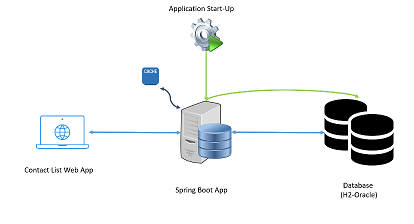

# Contact List Web Application

This project is a web based contact listing application that allows listing contacts, searching by name, paging. Its data is taken from a file on application start-up. Please find details below.

## Table of Contents

1. [Build and Run](#build-run)
2. [Technology Stack](#technology-stack)
3. [Test](#test)
4. [Architecture](#architecture)

## <a name="build-run"></a>Build and Run

This is a spring boot application, maven used as a build system.

There are 2 quick alternative ways to run the app in a Windows PC. The things to do to run the application on other operating systems such as Unix, MacOs etc. are similar.

1. CLI
    - Open a terminal in a suitable directory.
    - Clone the repository.
        - ```git clone https://github.com/mstftikir/contactlist.git```
    - Go inside of the directory
        - ```cd contactlist```
    - Run the app (make sure JAVA_HOME environment variable is being set.)
        - ```mvnw spring-boot:run```
2. IntelliJ
    - Open IntelliJ start-up page
        - 
    - Clone repository
        - 
    - Run the main class
        - 

## <a name="test"></a>Test

1. After the application run, it is going to be available in:
    - ```http://localhost:8080```
        - 
        - 
2. Rest address which gets all contacts:
    - ```http://localhost:8080/api/v1/contacts```
3. h2-console is a web app that H2 db records is available to be queried. T_CONTACT table is created at start up and filled out with data in people.csv
    - ```http://localhost:8080/h2-console```
    - H2 Login info:
        - 

## <a name="technology-stack"></a>Technology Stack

The application developed in a Windows 10 PC via IntelliJ Ultimate 2019.3 IDE.

1. Front End

    - [JQuery 3.5.1](https://jquery.com/)
    - [Datatables for JQuery](https://datatables.net/)
    - [MDBootstrap JQuery](https://mdbootstrap.com/docs/b4/jquery/)
    - [Bootstrap 4.5.0](https://getbootstrap.com/)
    - [Fontawsome 5.15.1](https://fontawesome.com/)
    - [Popper 1.14.7](https://popper.js.org/)
    - [HTML5](https://www.w3schools.com/html/)
    - [CSS3](https://www.w3schools.com/css/)

2. Back End
    - [Java 1.8](https://www.java.com/)
    - [Maven 4.0.0](https://maven.apache.org/)
    - [Spring Boot 2.4.1](https://spring.io/projects/spring-boot)
    - Spring Web
    - Spring Thymeleaf
    - Spring Tomcat
    - Spring JPA
    - Spring Cache
    - Spring Securiry
    - Spring Test
    - JUnit 4/5
    - Mockito

3. Database
    - H2 In Memory DB
    - Hibernate
    - Oracle DB
        - <b>Switchable from h2 to Oracle via spring profile in application.properties.</b>

## <a name="architecture"></a>Architecture

- When the spring boot application starts and ready, it reads data form people.csv and saves it to DB.
- Also, there is a caching mechanism on the controller.
- On first request, data is taken from DB and put into the in memory cache.
- On further requests if data not changed, it is being read from the cache.
- By default application starts with H2 in memory database, via ```spring.profiles.active=h2``` spring profile configuration in application.properties file.
- However, because Hibernate supports changing DB source via spring profile, it is easy to change datasource to another DB(e.g. Oracle DB).
- For example, if ```spring.profiles.active=oracle``` is configured, application-oracle.properties file is going to be active and application is going to integrate with Oracle DB:

- Architectural diagram:
    - 
